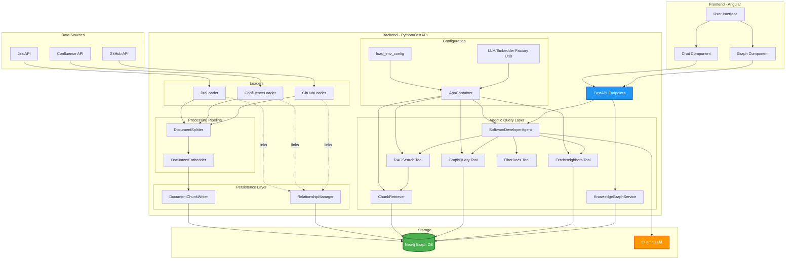
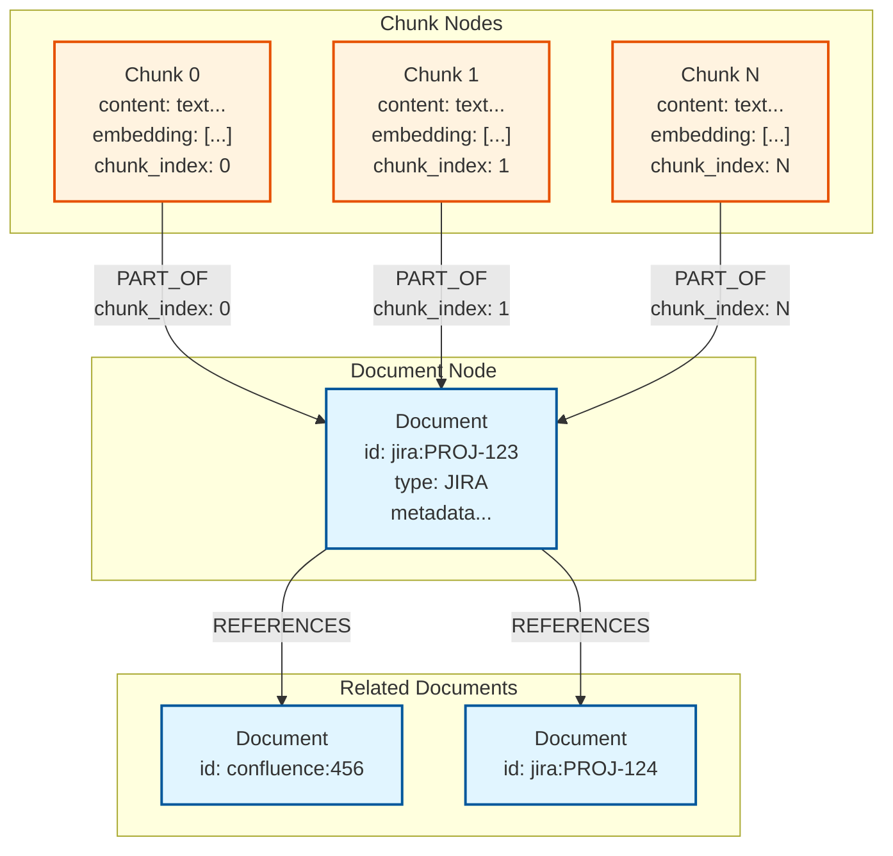
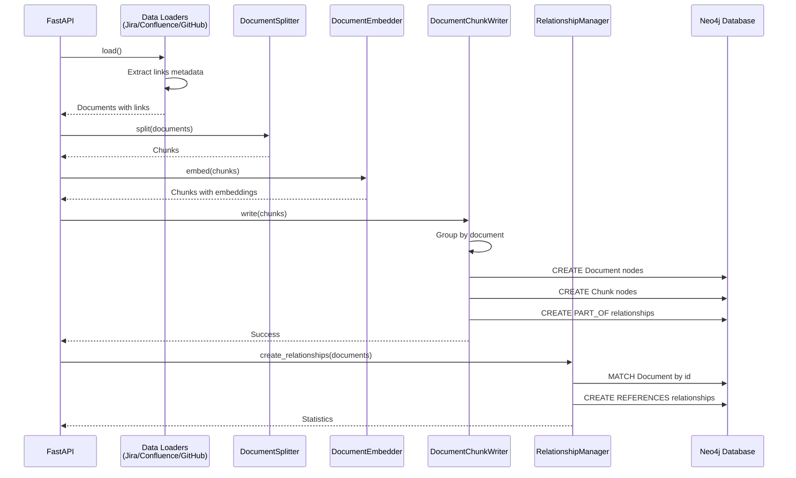
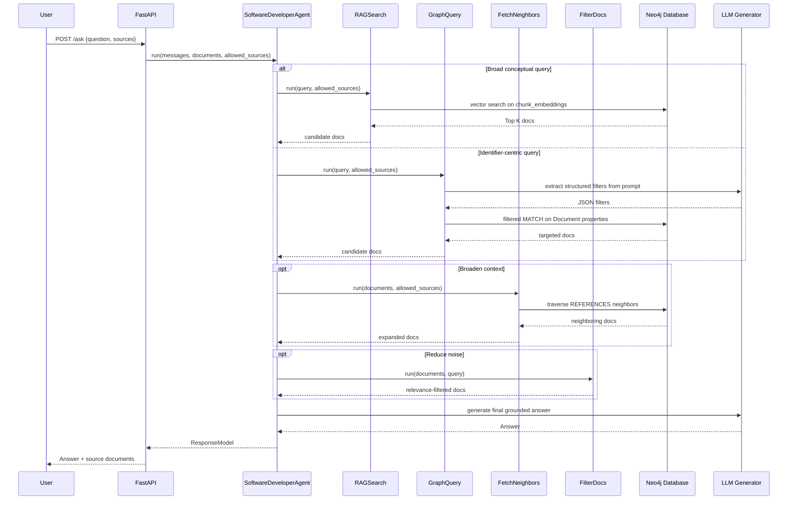
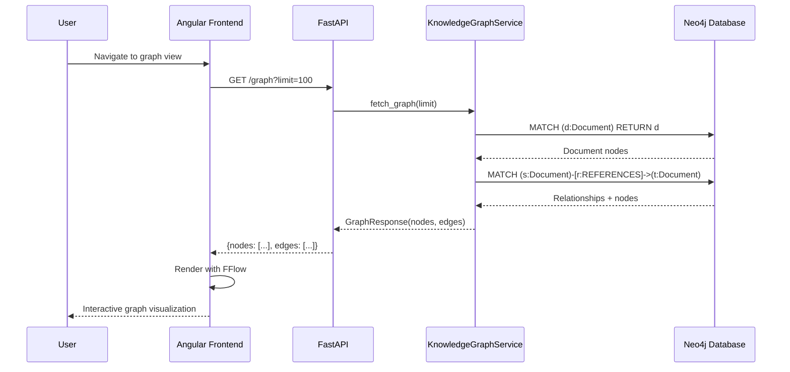
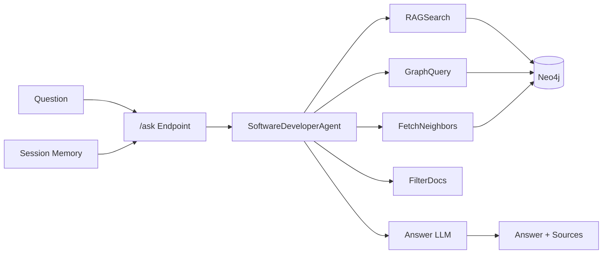

# Architecture

## Overview
The knowledge base has been refactored to implement a two-tier persistence model in Neo4j:

- **Document nodes**: Hold metadata and relationships between documents
- **Chunk nodes**: Hold content and embeddings, reference parent documents

This separation provides clearer semantics and better performance for both graph visualization and semantic search.

The query runtime uses an **Agentic RAG** approach. The `/ask` endpoint invokes a tool-using agent that can combine semantic retrieval, graph lookup, neighborhood expansion, and relevance filtering in one execution.

## System Architecture



## Architecture

### Node Structure



#### Document Nodes
- **Label**: `Document`
- **Properties**:
  - `id`: Unique identifier (e.g., `jira:PROJ-123`, `confluence:12345`, `github:repo:path/to/file.py`)
  - `type`: Document type (`JIRA`, `CONFLUENCE`, `GITHUB`)
  - Additional metadata specific to each type (issue_key, page_id, repo_name, etc.)
  - **NO embeddings or content**
- **Relationships**:
  - `REFERENCES`: Points to other Document nodes
  - `PART_OF` (incoming): Receives references from Chunk nodes

#### Chunk Nodes
- **Label**: `Chunk`
- **Properties**:
  - `id`: Hash-based unique identifier
  - `content`: Text content of the chunk
  - `embedding`: Vector embedding (768 dimensions)
  - `chunk_index`: Position of chunk within parent document (0-based)
- **Relationships**:
  - `PART_OF`: Points to parent Document node, includes `chunk_index` property for ordering
- **Index**:
  - Vector index `chunk_embeddings` on `embedding` property

### Data Flow

#### Indexing Flow



#### Query Flow



#### Graph Visualization Flow



## Key Components

### SoftwareDeveloperAgent
**Path**: `src/agents/__init__.py`

Central orchestrator for Agentic RAG:

- Decides which retrieval tool(s) to call per query
- Chains tools within one run (search -> neighbors -> filter)
- Maintains `documents` and `allowed_sources` in agent state

### RAGSearch
**Path**: `src/tools/rag_search_tool.py`

Semantic retrieval tool:

- Embeds query text and queries `ChunkRetriever`
- Applies source constraints through retriever filters when `allowed_sources` is provided

### GraphQuery
**Path**: `src/tools/graph_query_tool.py`

Precision graph lookup tool:

- Uses the LLM to extract structured filters (issue key, project key, repo, file path, etc.)
- Builds Cypher dynamically from extracted values
- Supports source filtering via `allowed_sources`
- Reconstructs document content by collecting related chunk text

### FetchNeighbors
**Path**: `src/tools/fetch_neighbors_tool.py`

Context expansion tool:

- Traverses `REFERENCES` relationships for already-selected documents
- Returns neighboring documents merged with current context
- Applies source filtering and de-duplicates by document `id`

### FilterDocs
**Path**: `src/tools/filter_docs_tool.py`

Post-retrieval relevance filtering:

- Scores documents by simple keyword overlap with query terms
- Removes low-signal documents (score 0)
- Sorts retained docs by descending score

### AppContainer and Config Utilities
**Path**: `src/config/__init__.py`
**Path**: `src/core/settings.py`

Runtime wiring and provider abstraction:

- `load_env_config()` centralizes environment parsing
- `AppContainer` provides dependency-injected factories for loaders, tools, index, and graph services
- Utility factory methods (`create_llm_generator`, `create_text_embedder`, `create_document_embedder`) encapsulate provider-specific setup (Ollama/OpenAI)

### DocumentChunkWriter
**Path**: `src/core/document_chunk_writer.py`

Creates the two-tier structure in Neo4j:

- Groups chunks by parent document
- Creates Document nodes with metadata (no embeddings)
- Creates Chunk nodes with content, embeddings, and chunk_index
- Links chunks to documents with PART_OF relationship (including chunk_index on relationship)
- Ensures `chunk_embeddings` vector index exists

### ChunkRetriever
**Path**: `src/core/chunk_retriever.py`

Custom retriever for embedding-based search:

- Queries `chunk_embeddings` vector index
- Traverses PART_OF relationship to parent Document
- Returns chunk content with document metadata
- Supports filtering by document type

### KnowledgeIndex
**Path**: `src/core/knowledge_index.py`

Orchestrates the indexing process:

- Uses DocumentChunkWriter instead of Neo4jDocumentStore
- Creates relationships between Documents (not Chunks)
- Provides stats about Documents and Chunks

### RelationshipManager
**Path**: `src/core/relationship_manager.py`

Creates REFERENCES edges between Document nodes:

- Uses LIMIT 1 to prevent duplicates
- Supports Jira ↔ Jira, Jira ↔ Confluence, GitHub ↔ * relationships
- Works with document IDs, not chunk IDs

### KnowledgeGraphService
**Path**: `src/core/knowledge_graph_service.py`

Fetches graph data for visualization:

- Returns Document nodes only (not Chunks)
- Returns REFERENCES relationships
- Provides relationship statistics

## Benefits

### 1. Clear Semantics
- Documents represent logical entities (issues, pages, files)
- Chunks are implementation details for embedding search
- Graph visualization shows documents, not technical chunks

### 2. Reduced Duplication
- One Document node per document (instead of N chunks labeled as "Document")
- REFERENCES relationships between documents (not N×M between all chunks)
- Metadata stored once per document

### 3. Better Performance
- Embedding search targets Chunks (smaller nodes, focused purpose)
- Graph queries target Documents (no need to deduplicate chunks)
- Relationship creation simpler (one edge per document pair)

### 4. Easier Maintenance
- Clear separation of concerns
- Simpler queries (no need for LIMIT 1 workarounds on chunks)
- More intuitive data model

## Configuration

### Environment Variables
```bash
# Vector index name for chunks (default: chunk_embeddings)
NEO4J_INDEX=chunk_embeddings

# Embedding dimension (default: 768)
EMBEDDING_DIMENSION=768

# Top K results for retrieval (default: 5)
NEO4J_TOP_K=5
```

### Neo4j Indexes
The system automatically creates:

- `chunk_embeddings`: Vector index on Chunk.embedding (cosine similarity)

## Chat History & Session Management Implementation

### Session Tracking Architecture

**SessionMiddleware** (`src/main.py`):

- Implements Starlette `BaseHTTPMiddleware`
- Checks for existing `X-Session-ID` in request cookies
- Generates UUID v4 if no session exists
- Stores session ID in `request.state.session_id` for endpoint access
- Sets HTTP-only cookie with:
  - 30-day expiration (`max_age=86400 * 30`)
  - `samesite="lax"` for CSRF protection
  - `secure=False` (set to `True` in production with HTTPS)
- Also adds `X-Session-ID` response header for visibility

### In-Memory Chat Storage

**ChatMemory Component** (`src/core/chat_memory.py`):

**Data Structures**:
```python
class ChatHistoryMessage(BaseModel):
    role: str  # 'user' or 'assistant'
    content: str
    timestamp: datetime
    sources: Optional[List[Dict[str, Any]]]  # Full source metadata

class ChatMemory:
    _memory: Dict[str, List[ChatHistoryMessage]]  # session_id -> messages
    _lock: Lock  # Thread-safe operations
    max_messages_per_session: int  # Default: 50
```

**Key Methods**:

- `add_message(session_id, role, content, sources)`: Store message with optional sources
- `get_history(session_id, limit)`: Retrieve conversation history
- `clear_session(session_id)`: Remove all messages for a session

**Thread Safety**:
All operations use `self._lock` to ensure concurrent request safety.

**Memory Management**:
Automatic FIFO truncation when `max_messages_per_session` exceeded:
```python
if len(self._memory[session_id]) > self.max_messages_per_session:
    self._memory[session_id] = self._memory[session_id][-self.max_messages_per_session:]
```

### Conversational Agentic RAG Pipeline

The conversational flow keeps multi-turn context in session memory and lets the agent choose tools at each turn.

1. **Session Context Stage**: Previous messages and retained documents are loaded from `ChatMemory`
2. **Tool-Orchestrated Retrieval Stage**: Agent selects and chains retrieval tools using the current question and source filters
3. **Answer Stage**: LLM answers using the final curated document set

**Pipeline Components** (`src/main.py`, `src/agents/__init__.py`, `src/tools/*.py`):



### Security & Privacy

**Session Isolation**:

- Each session ID is a cryptographically random UUID
- No cross-session data access
- Session-scoped storage prevents user data mixing

**Cookie Security**:

- `httponly=True`: Prevents JavaScript access (XSS protection)
- `samesite="lax"`: CSRF protection
- Should enable `secure=True` in production (HTTPS only)

**Data Lifecycle**:

- Sessions persist only in application memory
- Application restart clears all history
- No persistent storage of conversations (privacy by design)
- Users can manually clear via `/chat/clear` endpoint
