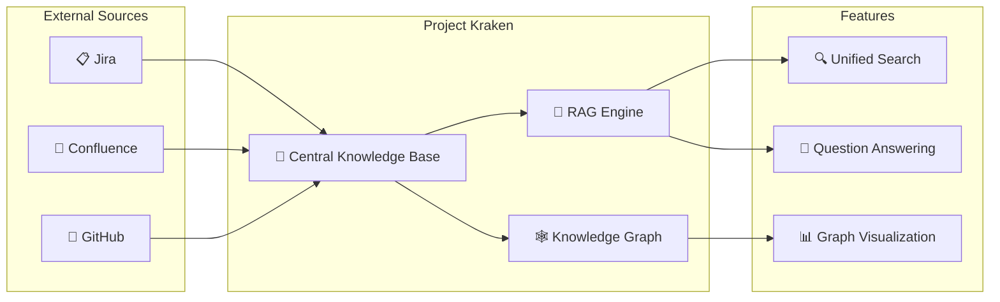
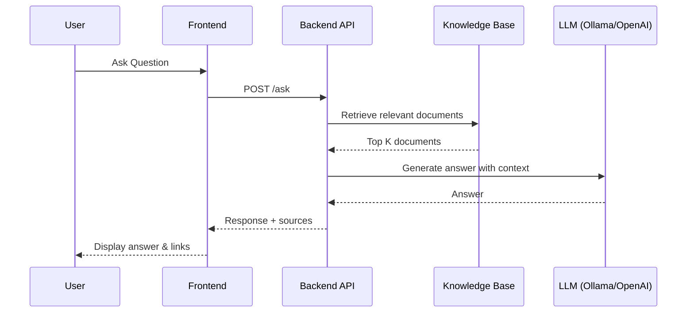

# Release the Kraken

Project Kraken is a **Central Knowledge Base** designed to bring together multiple sources of information
- Git 
- Confluence
- Jira

into a single, unified platform.

With **Project Kraken**, you can:
- 🗂️ Access all your resources in one place
- 🔍 Perform Retrieval-Augmented Generation (RAG) functions for smarter insights
- 🚀 Boost productivity and collaboration across teams

Unleash the power of seamless knowledge integration with Project Kraken! 🦑

## Architecture Overview

### How It Works

## Configuration

Project Kraken currently supports both [ollama](https://ollama.com/) and [OpenAI](https://openai.com/api/) as your GenAI provider. This can be configured via a set of environment variables (see: [.env.example](../.env.example)).

## Chat History & Session Management

Project Kraken implements intelligent chat history management to provide a seamless conversational experience across page reloads and sessions.

## Chat History & Session Management

Project Kraken implements intelligent chat history management to provide a seamless conversational experience.

### Key Features

**Session Tracking**: 
- Automatic session ID generation and cookie-based persistence
- 30-day session lifetime
- HTTP-only cookies for security

**Conversational Context**:
- Follow-up questions automatically rewritten using chat history
- Last 4 messages used as context for query understanding
- Seamless multi-turn conversations

**History Restoration**:
- Complete chat history restored on page reload
- All messages, responses, and source references preserved
- Instant access to previous conversations

<!-- ### Benefits

✅ **Seamless UX**: Conversations persist across reloads  
✅ **Contextual Awareness**: Follow-up questions work naturally  
✅ **Complete History**: All sources and references preserved  
✅ **Privacy**: Session-based isolation, in-memory storage  
✅ **Performance**: Fast in-memory access 

For detailed implementation, see [ARCHITECTURE.md](./ARCHITECTURE.md#chat-history--session-management-implementation).
-->
