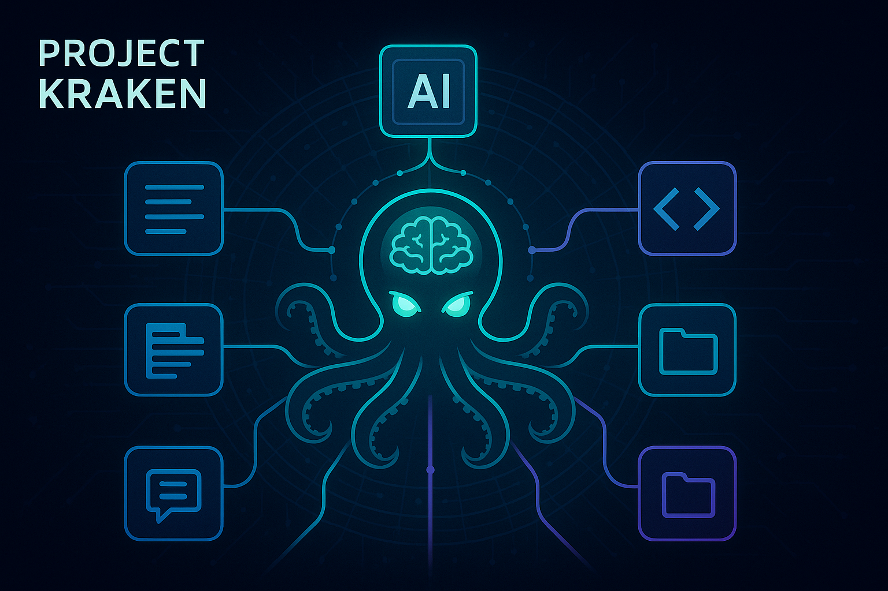
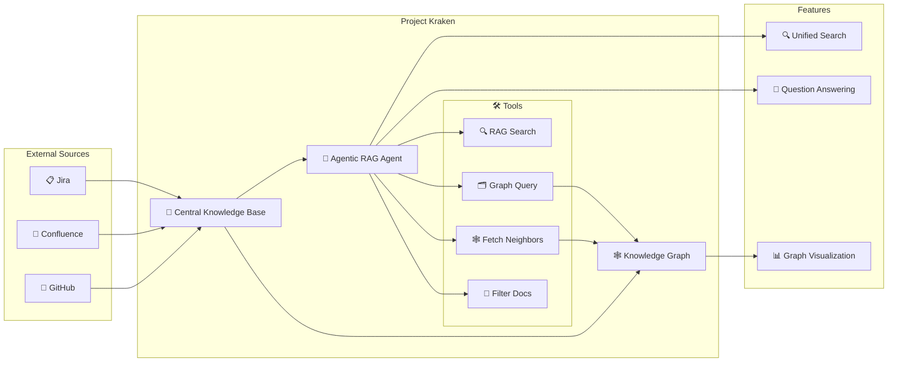
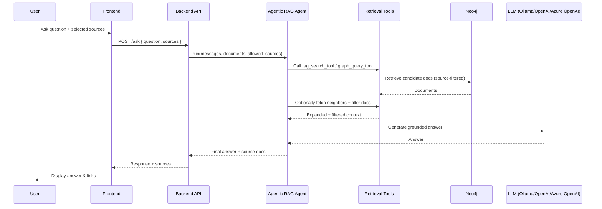

# Release the Kraken

Project Kraken is a **Central Knowledge Base** designed to bring together multiple sources of information:

- GitHub 
- Confluence
- Jira

into a single, unified platform.

With **Project Kraken**, you can:

- 🗂️ Access all your resources in one place
- 🤖 Perform Agentic Retrieval-Augmented Generation (Agentic RAG)
- 🚀 Boost productivity and collaboration across teams

Unleash the power of seamless knowledge integration with Project Kraken! 🦑

## Agentic RAG at a Glance

The runtime agent can dynamically combine these tools to generate an intelligent response to your query:

- **RAG Search Tool**: semantic retrieval over chunk embeddings
- **Graph Query Tool**: targeted Neo4j lookup using filters extracted from user prompts
- **Fetch Neighbors Tool**: graph neighborhood expansion via `REFERENCES` relationships
- **Filter Docs Tool**: post-retrieval pruning of weakly relevant documents

All retrieval tools support and respect source filters passed by the API request (for example: Jira-only, GitHub-only).

## Architecture Overview

### How It Works

## Configuration

Project Kraken currently supports [ollama](https://ollama.com/), [OpenAI](https://openai.com/api/) and [Azure OpenAI](https://learn.microsoft.com/en-us/azure/foundry/openai/reference) as your GenAI provider.

Configuration is centralized through:

- `load_env_config()` for environment parsing
- `AppContainer` for dependency wiring and runtime component creation
- provider utility factories for chat generator and embedders

See: [.env.example](../.env.example) and [ARCHITECTURE.md](./ARCHITECTURE.md).

## Chat History & Session Management

Project Kraken implements intelligent chat history management to provide a seamless conversational experience across page reloads and sessions.

### Key Features

**Session Tracking**: 

- Automatic session ID generation and cookie-based persistence
- 30-day session lifetime
- HTTP-only cookies for security

**Conversational Context**:

- Follow-up questions automatically rewritten using chat history
- Last 4 messages used as context for query understanding
- Seamless multi-turn conversations

**History Restoration**:

- Complete chat history restored on page reload
- All messages, responses, and source references preserved
- Instant access to previous conversations
