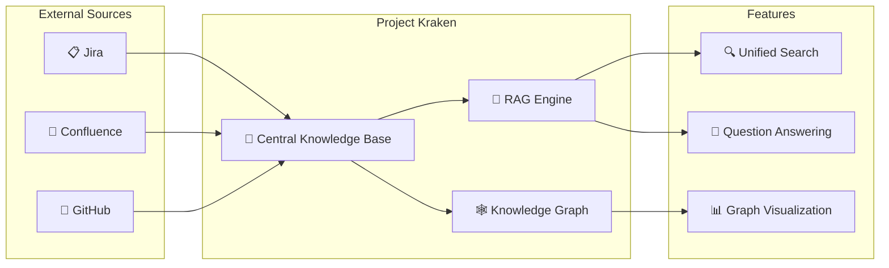
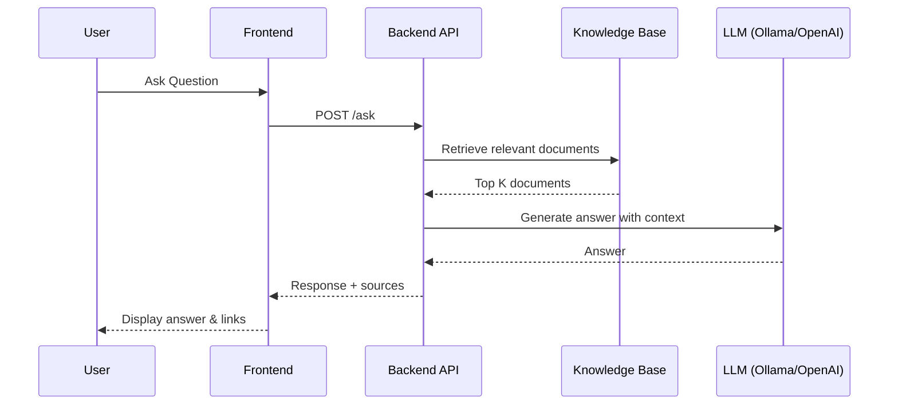

# Release the Kraken

Project Kraken is a **Central Knowledge Base** designed to bring together multiple sources of information
- Git 
- Confluence
- Jira

into a single, unified platform.

With **Project Kraken**, you can:
- 🗂️ Access all your resources in one place
- 🔍 Perform Retrieval-Augmented Generation (RAG) functions for smarter insights
- 🚀 Boost productivity and collaboration across teams

Unleash the power of seamless knowledge integration with Project Kraken! 🦑

## Architecture Overview

### How It Works

## Configuration

You can currently switch between [ollama](https://ollama.com/) and [OpenAI](https://openai.com/api/) as our GenAI provider. This can be configured via a set of environment variables (see: [.env.example](../.env.example)).

