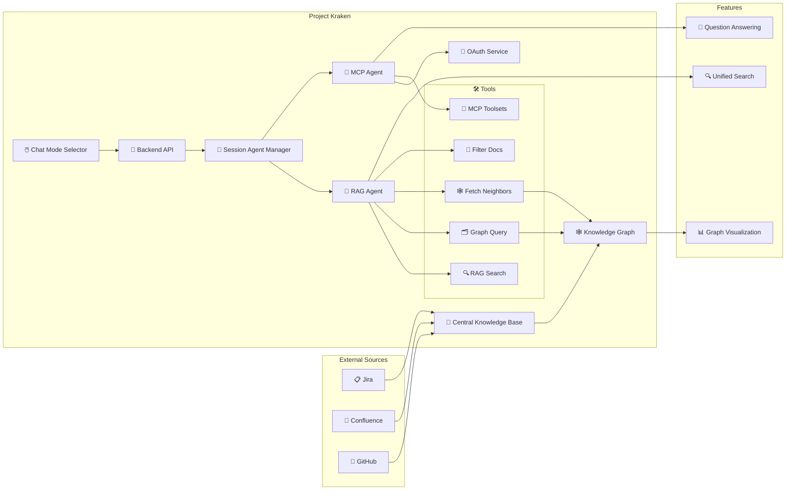
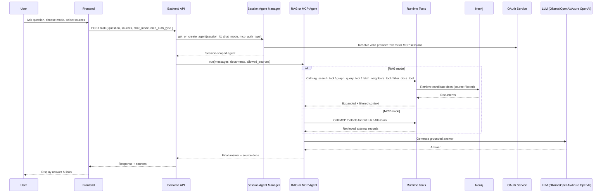

# Release the Kraken

Project Kraken is a **Central Knowledge Base** designed to bring together multiple sources of information:

- GitHub 
- Confluence
- Jira

into a single, unified platform.

With **Project Kraken**, you can:

- 🗂️ Access all your resources in one place
- 🤖 Choose between Agentic RAG and MCP-backed answers from the UI
- 🚀 Boost productivity and collaboration across teams

Unleash the power of seamless knowledge integration with Project Kraken! 🦑

## RAG and MCP at a Glance

The chat UI lets you select the runtime mode per request:

- **RAG** uses the knowledge graph and retrieval tools to answer from indexed content
- **MCP** uses session-scoped OAuth-backed MCP tools to query external systems through GitHub and Atlassian

The RAG runtime can dynamically combine these tools to generate an intelligent response to your query:

- **RAG Search Tool**: semantic retrieval over chunk embeddings
- **Graph Query Tool**: targeted Neo4j lookup using filters extracted from user prompts
- **Fetch Neighbors Tool**: graph neighborhood expansion via `REFERENCES` relationships
- **Filter Docs Tool**: post-retrieval pruning of weakly relevant documents

All RAG retrieval tools support and respect source filters passed by the API request (for example: Jira-only, GitHub-only).

## Architecture Overview

### How It Works

## MCP OAuth

MCP mode is backed by backend-owned OAuth 2.1 flow handling. The browser only starts the connect flow and never stores tokens.

1. The frontend sends the user to the backend connect endpoint for a provider.
2. The backend discovers MCP metadata from the provider, including the protected-resource and authorization-server details.
3. The backend generates PKCE state, stores the pending transaction in the session store, and redirects to the provider authorization endpoint.
4. The callback exchanges the code for tokens and stores them in the backend session.
5. The session agent manager resolves the correct MCP toolset for the current user on each request, refreshing tokens when needed.

Atlassian uses discovery-first OAuth with dynamic client registration when available. GitHub falls back to a preconfigured client when discovery does not provide dynamic registration support.

### Service Credentials Fallback

When the UI sends `mcp_auth_type: service_credentials`, the session agent manager skips per-user OAuth entirely and uses static access tokens loaded from environment variables. This is useful for development, shared deployments, or providers where interactive OAuth is not yet set up.

| Provider | Environment variables (first match wins) |
|---|---|
| GitHub | `GITHUB_SERVICE_ACCESS_TOKEN`, `GITHUB_ACCESS_TOKEN`, `MCP_GITHUB_ACCESS_TOKEN` |
| Atlassian | `ATLASSIAN_SERVICE_ACCESS_TOKEN`, `ATLASSIAN_ACCESS_TOKEN`, `MCP_ATLASSIAN_ACCESS_TOKEN` |

A GitHub OAuth app client can also be pre-registered via `GITHUB_OAUTH_CLIENT_ID` + `GITHUB_OAUTH_CLIENT_SECRET` (aliases: `GITHUB_APP_CLIENT_ID` / `GITHUB_APP_CLIENT_SECRET`) to enable the Authorization Code + PKCE flow without dynamic client registration.

## Configuration

Project Kraken currently supports [ollama](https://ollama.com/), [OpenAI](https://openai.com/api/) and [Azure OpenAI](https://learn.microsoft.com/en-us/azure/foundry/openai/reference) as your GenAI provider.

For MCP mode, OAuth is handled entirely by the backend through session-scoped discovery, PKCE, token exchange, and provider-specific tool construction.

Configuration is centralized through:

- `load_env_config()` for environment parsing
- `AppContainer` for dependency wiring and runtime component creation
- provider utility factories for chat generator and embedders

See: [.env.example](../.env.example) and [ARCHITECTURE.md](./ARCHITECTURE.md).

## Chat History & Session Management

Project Kraken implements intelligent chat history management to provide a seamless conversational experience across page reloads and sessions.

### Key Features

**Session Tracking**: 

- Automatic session ID generation and cookie-based persistence
- 30-day session lifetime
- HTTP-only cookies for security

**Conversational Context**:

- Follow-up questions automatically rewritten using chat history
- Last 4 messages used as context for query understanding
- Seamless multi-turn conversations

**History Restoration**:

- Complete chat history restored on page reload
- All messages, responses, and source references preserved
- Instant access to previous conversations
